# tui-piechart

[](https://crates.io/crates/tui-piechart)
[](https://docs.rs/tui-piechart)
[](https://opensource.org/licenses/MIT)
[](https://github.com/sorinirimies/tui-piechart/actions/workflows/release.yml)
[](https://github.com/sorinirimies/tui-piechart/actions/workflows/ci.yml)

A customizable pie chart widget for [Ratatui](https://github.com/ratatui/ratatui) TUI applications.

## Preview - High Resolution Mode
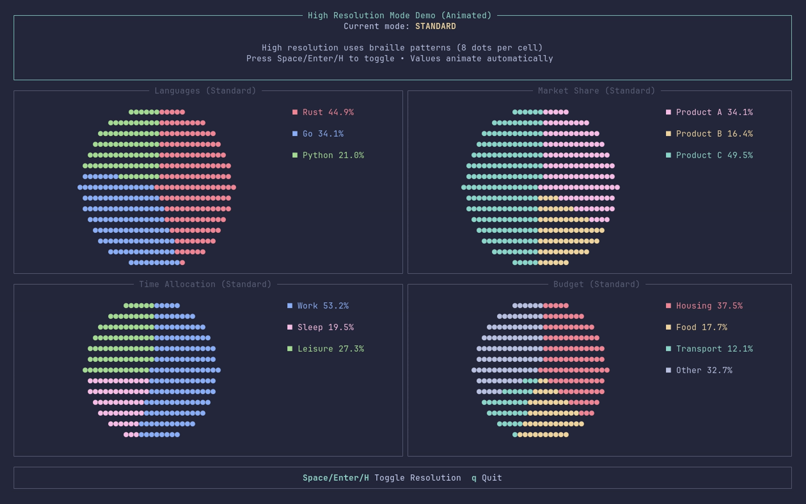


## Features

- 🥧 Simple pie chart with customizable slices
- 🎨 Customizable colors for each slice
- 🔤 Labels and percentages
- 📊 Legend support with position, layout, and alignment options
- 📦 Optional block wrapper with multiple border styles
- ✨ Custom symbols for pie chart and legend
- 🔍 High resolution mode using braille patterns (8x resolution)
- ⚡ Zero-cost abstractions

## Installation

Add this to your `Cargo.toml`:

```toml
[dependencies]
tui-piechart = "0.1.0"
ratatui = "0.29"
```

Or install with cargo:

```bash
cargo add tui-piechart
```

## Quick Start

```rust
use ratatui::style::Color;
use tui_piechart::{PieChart, PieSlice};

// Create slices
let slices = vec![
    PieSlice::new("Rust", 45.0, Color::Red),
    PieSlice::new("Go", 30.0, Color::Blue),
    PieSlice::new("Python", 25.0, Color::Green),
];

// Create pie chart
let piechart = PieChart::new(slices);

// With customization
let piechart = PieChart::new(slices)
    .show_legend(true)
    .show_percentages(true)
    .pie_char('●');

// With a block
use ratatui::widgets::Block;

let piechart = PieChart::new(slices)
    .block(Block::bordered().title("Statistics"));

// With high resolution mode (braille patterns for 8x resolution)
let piechart = PieChart::new(slices)
    .high_resolution(true);

// Or use the Resolution enum
use tui_piechart::Resolution;

let standard = PieChart::new(slices).resolution(Resolution::Standard);
let braille = PieChart::new(slices).resolution(Resolution::Braille);
```

## Legend Customization

The library provides comprehensive legend control with three key aspects:

### Position
Control where the legend appears relative to the pie chart:
```rust
use tui_piechart::{PieChart, LegendPosition};

let chart = PieChart::new(slices)
    .legend_position(LegendPosition::Right)   // Default
    .legend_position(LegendPosition::Left)
    .legend_position(LegendPosition::Top)
    .legend_position(LegendPosition::Bottom);
```

### Layout
Choose between vertical (stacked) or horizontal (single row) arrangement:
```rust
use tui_piechart::{PieChart, LegendLayout};

let chart = PieChart::new(slices)
    .legend_layout(LegendLayout::Vertical)     // Default - items stacked
    .legend_layout(LegendLayout::Horizontal);  // Items in a row
```

### Alignment
Align legend items within their allocated space (particularly useful for grid layouts):
```rust
use tui_piechart::{PieChart, LegendAlignment};

let chart = PieChart::new(slices)
    .legend_alignment(LegendAlignment::Left)    // Default
    .legend_alignment(LegendAlignment::Center)  // Centered - great for grids
    .legend_alignment(LegendAlignment::Right);  // Right-aligned
```

### Combined Example
```rust
let chart = PieChart::new(slices)
    .legend_position(LegendPosition::Bottom)
    .legend_layout(LegendLayout::Horizontal)
    .legend_alignment(LegendAlignment::Center);
```

This gives you **24 possible combinations** (4 positions × 2 layouts × 3 alignments) to perfectly match your UI design!

## Modules

The library is organized into focused modules:

- **`legend`** - Legend positioning, layout, and alignment configuration
  - `LegendPosition` - Position legend on any side (Right, Left, Top, Bottom)
  - `LegendLayout` - Vertical or Horizontal layout modes
  - `LegendAlignment` - Align items Left, Center, or Right within their area
  
- **`title`** - Title positioning, alignment, and font styling for block wrappers
  - `TitleAlignment` - Horizontal alignment (Start, Center, End)
  - `TitlePosition` - Vertical position (Top, Bottom)
  - `TitleStyle` - Unicode font styles (Bold, Italic, Script, Sans-Serif, Monospace, etc.)
  - `BlockExt` - Extension trait for ergonomic title customization

- **`border_style`** - Predefined border styles for block wrappers
  - 11 border style variants (Standard, Rounded, Dashed, Thick, etc.)
  
- **`symbols`** - Predefined Unicode symbols for pie charts and legends
  - Circle, square, star, heart, triangle, and many more

All commonly used types are re-exported from the crate root for convenience:

```rust
use tui_piechart::{PieChart, PieSlice, LegendPosition, LegendLayout};

// Or import from specific modules:
use tui_piechart::legend::{LegendPosition, LegendLayout};
use tui_piechart::title::{TitleAlignment, TitlePosition, BlockExt};
use tui_piechart::border_style::BorderStyle;
```

## Examples

Run the included examples:

```bash
# Main interactive example (4 charts)
cargo run --example piechart

# Predefined symbols examples (4 charts each):
cargo run --example symbols_circles_squares      # Default, Block, Circle, Square
cargo run --example symbols_stars_hearts         # Diamond, Star, White Star, Heart
cargo run --example symbols_triangles_hexagons   # Triangle, Hexagon, Bullseye, Square Box
cargo run --example symbols_shades_bars          # Asterism, Horizontal Bar, Shade, Light

# Layout and positioning examples:
cargo run --example legend_positioning           # 4 positions × 2 layouts
cargo run --example legend_alignment             # 3 alignments × 4 positions × 2 layouts
cargo run --example title_positioning            # 2 positions × 3 alignments
cargo run --example title_styles_example         # 10 Unicode font styles

# Border styles showcase (11 charts in 4-row grid)
cargo run --example border_styles

# Custom (non-predefined) symbols showcase (12 charts)
cargo run --example custom_symbols

# High resolution mode demo (animated, toggle with Space)
cargo run --example high_resolution

# Or use just commands:
just run-legend-positioning
just run-legend-alignment
just run-title-positioning
just run-title-styles-example
just run-border-styles
just run-custom-symbols
just run-high-resolution
```

### Detailed Examples Documentation

For comprehensive documentation of all examples, see [EXAMPLES.md](EXAMPLES.md).

---

## Example Demos

### 1. Main Interactive Demo

**Run:** `cargo run --example piechart`

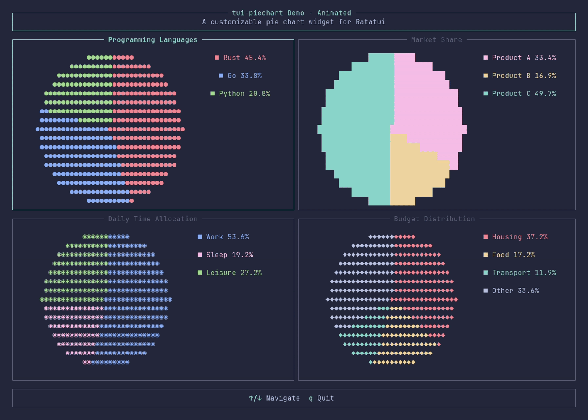

- 4 different pie chart examples
- Interactive navigation with arrow keys
- Tab to switch to API Showcase mode

---

### 2-5. Symbol Examples

#### Circles & Squares
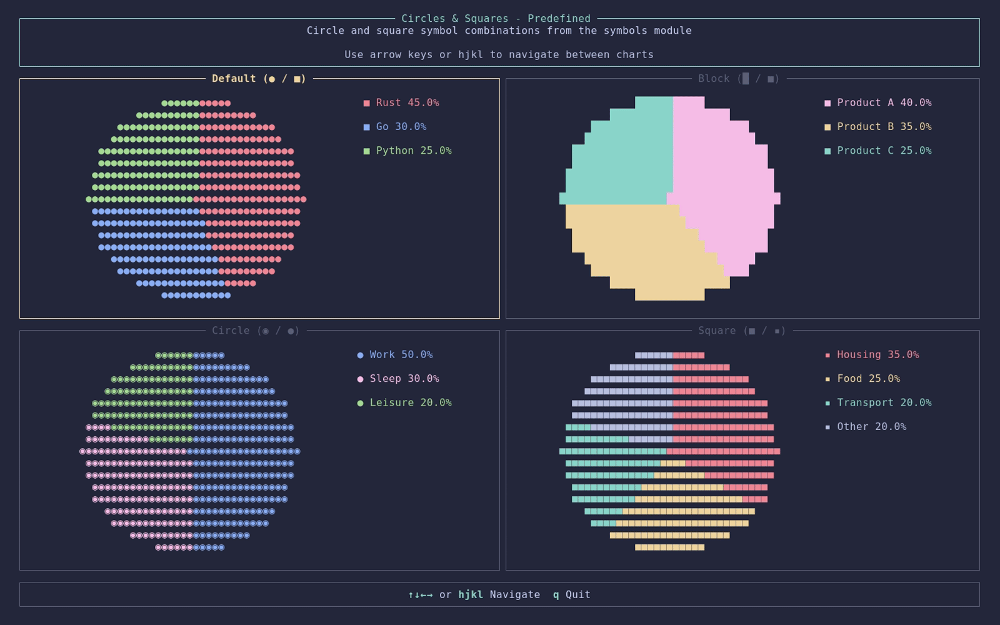

#### Stars & Hearts
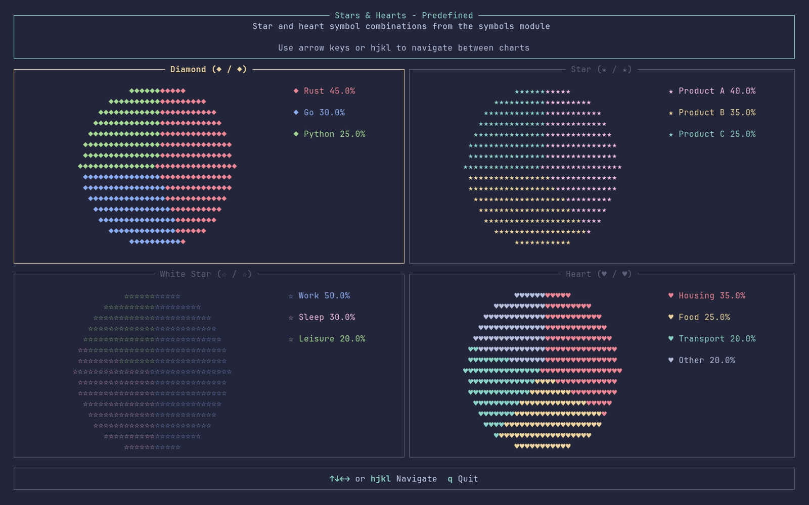

#### Triangles & Hexagons
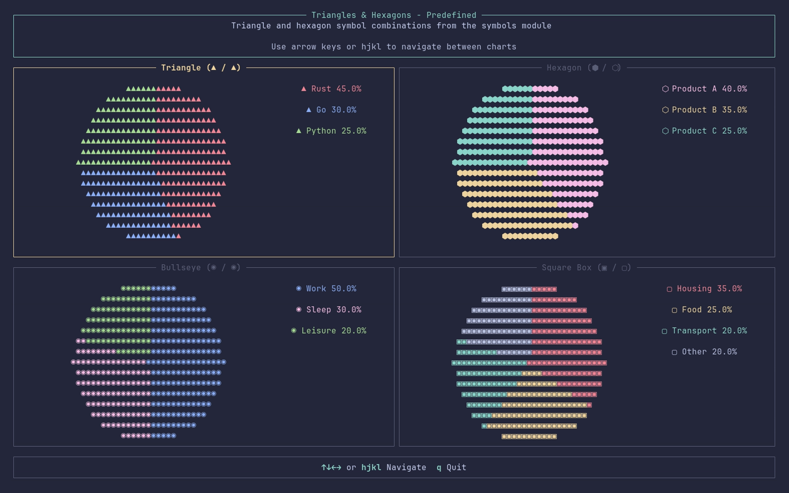

#### Shades & Bars
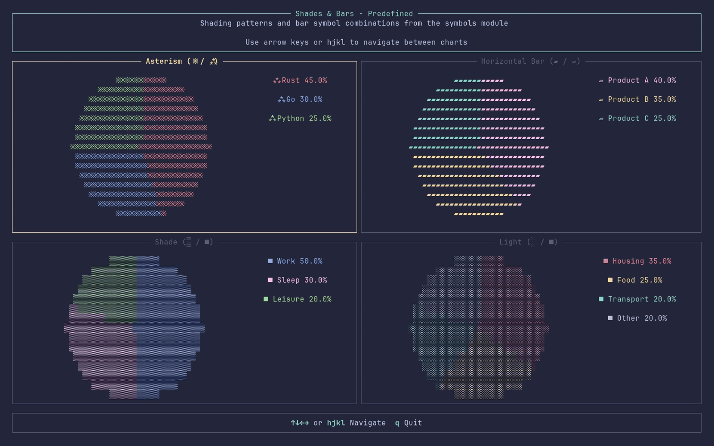

---

### 6. Legend Positioning

**Run:** `cargo run --example legend_positioning`

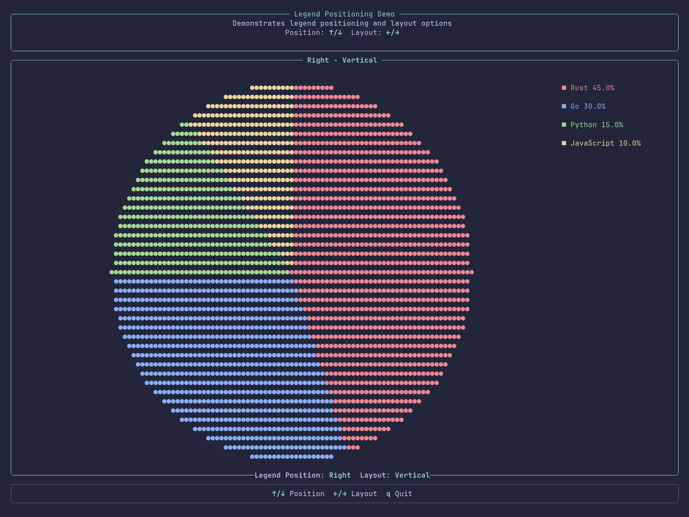

- 4 positions: Right, Left, Top, Bottom
- 2 layouts: Vertical, Horizontal
- Interactive: ↑/↓ for position, ←/→ for layout

---

### 7. Title Positioning

**Run:** `cargo run --example title_positioning`

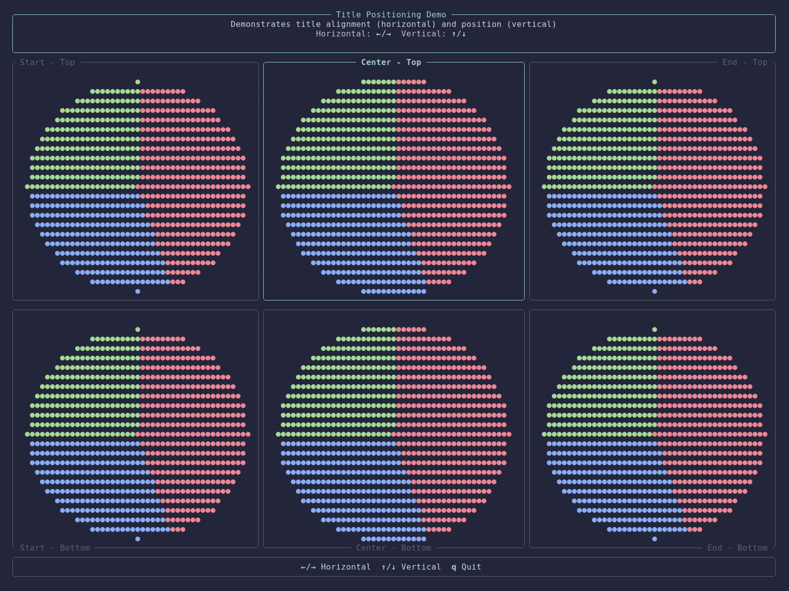

- 2 vertical positions: Top, Bottom
- 3 horizontal alignments: Start, Center, End
- Interactive: ↑/↓ for position, ←/→ for alignment

---

### 8. Title Font Styles

**Run:** `cargo run --example title_styles_example`

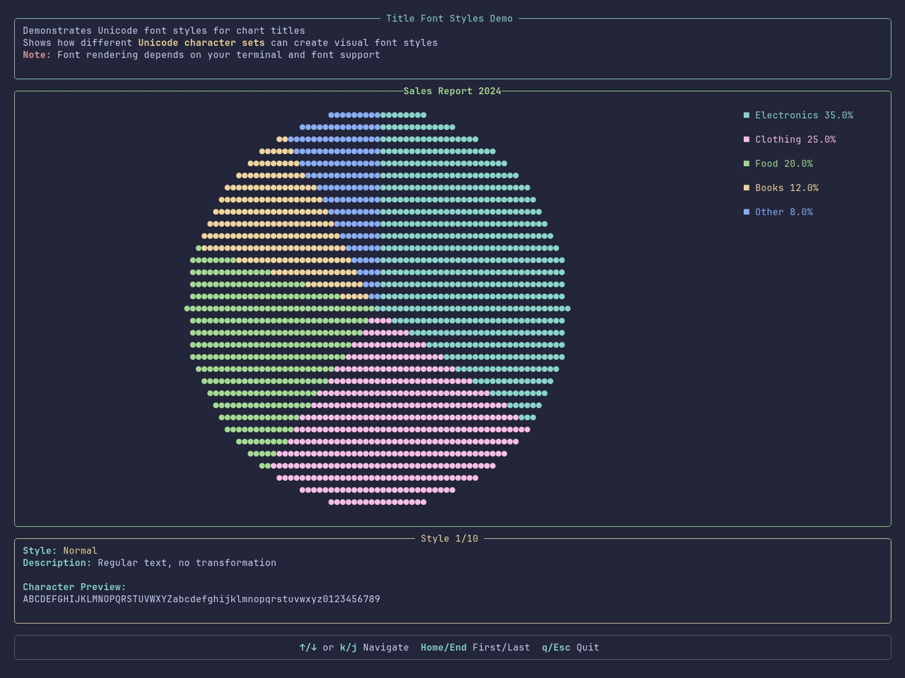

- 10 Unicode font styles
- Bold, Italic, Script, Sans-Serif, Monospace, and more
- Interactive: ↑/↓ to navigate styles

---

### 9. Border Styles

**Run:** `cargo run --example border_styles`

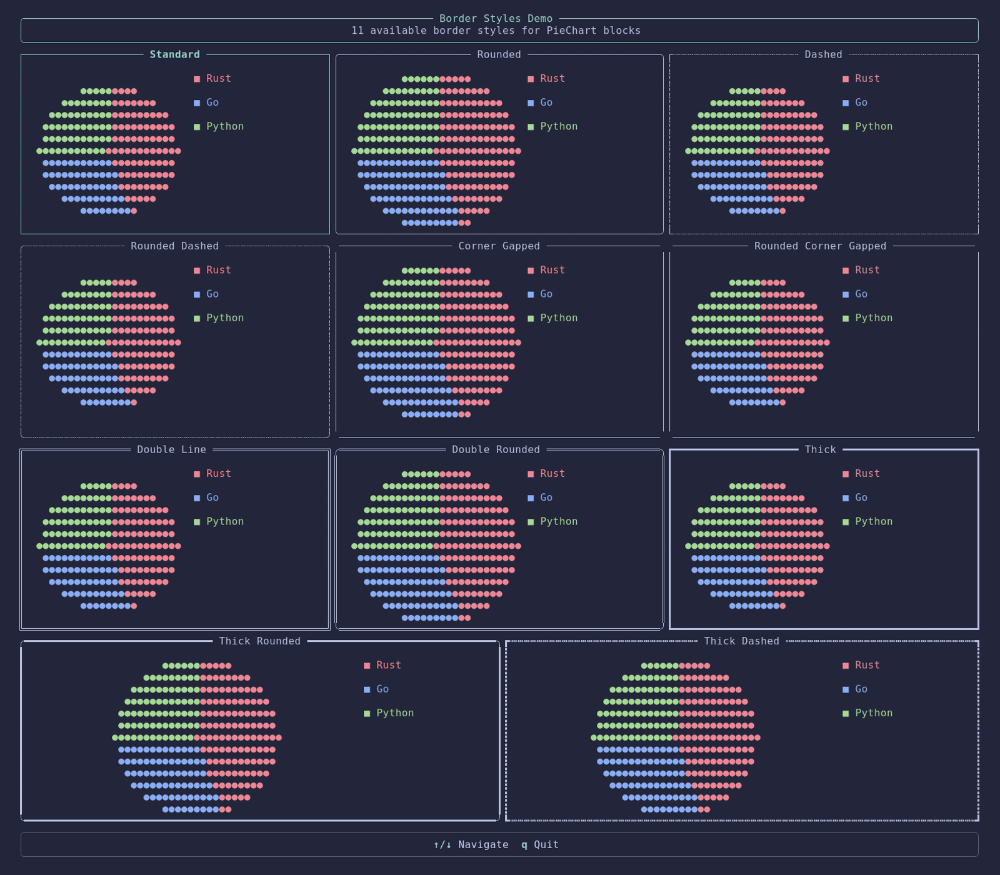

- 11 border style variants
- Standard, Rounded, Dashed, Thick, Double-line, and combinations
- Interactive: ↑/↓ to navigate styles

---

### 10. Custom Symbols

**Run:** `cargo run --example custom_symbols`

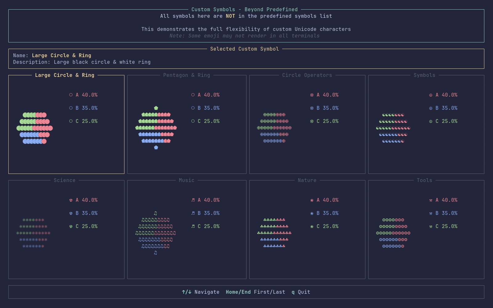

- 8 custom Unicode symbols not in predefined list
- Demonstrates unlimited customization potential
- Emoji support (terminal-dependent)

---

### 11. High Resolution Mode

**Run:** `cargo run --example high_resolution`


- Braille patterns for 8x resolution
- Animated values with smooth transitions
- Press Space/Enter/H to toggle resolution
- ~60 FPS animations

---

## Quick Examples Reference

| Example | Command | Features |
|---------|---------|----------|
| Main Demo | `cargo run --example piechart` | 4 chart types, interactive |
| Circles & Squares | `cargo run --example symbols_circles_squares` | Basic symbols |
| Stars & Hearts | `cargo run --example symbols_stars_hearts` | Decorative symbols |
| Triangles & Hexagons | `cargo run --example symbols_triangles_hexagons` | Geometric symbols |
| Shades & Bars | `cargo run --example symbols_shades_bars` | Pattern symbols |
| Legend Positioning | `cargo run --example legend_positioning` | 4 positions × 2 layouts |
| Legend Alignment | `cargo run --example legend_alignment` | 3 alignments × 4 positions × 2 layouts |
| Title Positioning | `cargo run --example title_positioning` | 2 positions × 3 alignments |
| Title Styles | `cargo run --example title_styles_example` | 10 font styles |
| Border Styles | `cargo run --example border_styles` | 11 border variants |
| Custom Symbols | `cargo run --example custom_symbols` | 8 custom symbols |
| High Resolution | `cargo run --example high_resolution` | Braille rendering |

For detailed documentation on each example, usage patterns, and more, see [EXAMPLES.md](EXAMPLES.md).

---

### Visual Previews (Legacy)

**Main Interactive Demo:**


**Predefined Symbols:**

| Circles & Squares | Stars & Hearts |
|-------------------|----------------|
|  |  |

| Triangles & Hexagons | Shades & Bars |
|----------------------|---------------|
|  |  |

**Border Styles:**


**Custom Symbols:**


**High Resolution Mode:**


*All demos generated with [VHS](https://github.com/charmbracelet/vhs). See [EXAMPLES.md](EXAMPLES.md) for detailed documentation.*

### Interactive Mode (Default)

Navigate through different chart types with your keyboard:
- **↑/↓** or **k/j** - Navigate between charts
- **Tab** - Switch to API Showcase mode
- **q** or **Esc** - Quit

The interactive mode demonstrates:
- Programming language distribution chart
- Market share visualization
- Time allocation pie chart
- Budget distribution chart

### API Showcase Mode

Press **Tab** to switch to the API showcase view, which displays:
- Basic usage (`new()`, `default()`, `slices()`)
- Styling options (`show_legend()`, `show_percentages()`, `pie_char()`)
- Custom symbols (circle, square, diamond, block)
- Multiple slices handling

## Customization

### Colors

Each slice can have its own color:

```rust
let slices = vec![
    PieSlice::new("Category A", 40.0, Color::Red),
    PieSlice::new("Category B", 35.0, Color::Blue),
    PieSlice::new("Category C", 25.0, Color::Green),
];
```

### Display Options

Control what information is shown:

```rust
let piechart = PieChart::new(slices)
    .show_legend(true)       // Show/hide legend
    .show_percentages(true); // Show/hide percentages in legend
```

### Border Styles

Customize the appearance of the block wrapper using predefined border styles:

```rust
use tui_piechart::border_style::BorderStyle;
// Or use backwards-compatible path: use tui_piechart::symbols::BorderStyle;

// Standard single-line borders (default)
let piechart = PieChart::new(slices)
    .block(BorderStyle::Standard.block().title("My Chart"));

// Rounded corners
let piechart = PieChart::new(slices)
    .block(BorderStyle::Rounded.block().title("My Chart"));

// Dashed borders (dashed lines throughout)
let piechart = PieChart::new(slices)
    .block(BorderStyle::Dashed.block().title("My Chart"));

// Corner gaps only (minimalist look)
let piechart = PieChart::new(slices)
    .block(BorderStyle::CornerGapped.block().title("My Chart"));

// Thick borders
let piechart = PieChart::new(slices)
    .block(BorderStyle::Thick.block().title("My Chart"));

// Double-line borders
let piechart = PieChart::new(slices)
    .block(BorderStyle::DoubleLineStandard.block().title("My Chart"));
```

**Available Border Styles (11 total):**

*Single-line variants:*
- `BorderStyle::Standard` - Standard single-line borders (default)
- `BorderStyle::Rounded` - Rounded corners with single-line borders
- `BorderStyle::Dashed` - Dashed lines throughout (┄┄┄)
- `BorderStyle::RoundedDashed` - Rounded corners with dashed lines
- `BorderStyle::CornerGapped` - Continuous lines with gaps only at corners
- `BorderStyle::RoundedCornerGapped` - Rounded with gaps only at corners

*Double-line variants:*
- `BorderStyle::DoubleLineStandard` - Double-line borders (═══)
- `BorderStyle::DoubleLineRounded` - Double-line edges with rounded corners (mixed style)*

*Thick-line variants:*
- `BorderStyle::Thick` - Thick/heavy line borders (━━━)
- `BorderStyle::ThickRounded` - Thick edges with rounded corners (mixed style)*
- `BorderStyle::ThickDashed` - Thick dashed lines (┅┅┅)

See the [border_styles example](examples/border_styles.rs) for a visual demonstration of all styles.

**Note:** *DoubleLineRounded and ThickRounded use mixed styles (single-line rounded corners with double/thick-line edges) because Unicode doesn't have true rounded double-line or thick-line box-drawing characters.

### Title Alignment

Customize the alignment and position of block titles:

```rust
use tui_piechart::border_style::{BorderStyle, BlockExt, TitleAlignment, TitlePosition};

// Horizontal alignment
let block = BorderStyle::Rounded.block()
    .title("My Chart")
    .title_alignment_horizontal(TitleAlignment::Center); // Left, Center, Right

// Vertical position
let block = BorderStyle::Rounded.block()
    .title("Top Title")
    .title_vertical_position(TitlePosition::Top)
    .title_bottom("Bottom Title")
    .title_alignment(Alignment::Center);
```

**Available Options:**
- **Horizontal:** `TitleAlignment::Left`, `TitleAlignment::Center`, `TitleAlignment::Right`
- **Vertical:** `TitlePosition::Top`, `TitlePosition::Bottom`

### Legend Positioning

Control where the legend appears and how it's laid out:

```rust
use tui_piechart::{PieChart, LegendPosition, LegendLayout};

// Position the legend
let chart = PieChart::new(slices)
    .legend_position(LegendPosition::Right)  // Right, Left, Top, Bottom
    .legend_layout(LegendLayout::Vertical);  // Vertical or Horizontal

// Example: horizontal legend at the bottom
let chart = PieChart::new(slices)
    .legend_position(LegendPosition::Bottom)
    .legend_layout(LegendLayout::Horizontal);
```

**Legend Positions:**
- `LegendPosition::Right` - Legend on the right side (default)
- `LegendPosition::Left` - Legend on the left side
- `LegendPosition::Top` - Legend at the top
- `LegendPosition::Bottom` - Legend at the bottom

**Legend Layouts:**
- `LegendLayout::Vertical` - Items stacked vertically (default)
- `LegendLayout::Horizontal` - Items in a single row

The legend automatically calculates the required space based on content to prevent text cutoff.

See the [legend_positioning example](examples/legend_positioning.rs) for an interactive demonstration.

### Custom Symbols

The pie chart widget allows full customization of symbols used for rendering. You can use **any Unicode character** for the pie chart and **any string** for legend markers.

#### Basic Usage

```rust
use tui_piechart::symbols;

// Using predefined symbols
let piechart = PieChart::new(slices)
    .pie_char(symbols::PIE_CHAR_BLOCK)              // █
    .legend_marker(symbols::LEGEND_MARKER_CIRCLE);  // ●

// Using custom characters
let piechart = PieChart::new(slices)
    .pie_char('★')       // Any Unicode character
    .legend_marker("→"); // Any string
```

## Predefined Symbols

The `symbols` module provides carefully selected characters that work well in most terminals:

### Pie Chart Characters

**Basic Shapes:**
- `symbols::PIE_CHAR` - ● (default, filled circle)
- `symbols::PIE_CHAR_BLOCK` - █ (solid block, high density)
- `symbols::PIE_CHAR_CIRCLE` - ◉ (circle with center dot)
- `symbols::PIE_CHAR_SQUARE` - ■ (solid square)
- `symbols::PIE_CHAR_DIAMOND` - ◆ (solid diamond)
- `symbols::PIE_CHAR_HEXAGON` - ⬢ (filled hexagon)
- `symbols::PIE_CHAR_BULLSEYE` - ◉ (bullseye circle)
- `symbols::PIE_CHAR_SQUARE_BOX` - ▣ (squared box)

**Shading Patterns:**
- `symbols::PIE_CHAR_SHADE` - ▒ (medium shade pattern)
- `symbols::PIE_CHAR_LIGHT` - ░ (light shade pattern)
- `symbols::PIE_CHAR_DARK` - ▓ (dark shade pattern)

**Circle Variations:**
- `symbols::PIE_CHAR_SMALL_CIRCLE` - • (small filled circle)
- `symbols::PIE_CHAR_WHITE_CIRCLE` - ○ (hollow circle)
- `symbols::PIE_CHAR_DOUBLE_CIRCLE` - ◎ (circle with ring)

**Square Variations:**
- `symbols::PIE_CHAR_SMALL_SQUARE` - ▪ (small filled square)
- `symbols::PIE_CHAR_WHITE_SQUARE` - □ (hollow square)

**Diamond Variations:**
- `symbols::PIE_CHAR_SMALL_DIAMOND` - ◆ (small filled diamond)
- `symbols::PIE_CHAR_WHITE_DIAMOND` - ◇ (hollow diamond)

**Stars:**
- `symbols::PIE_CHAR_STAR` - ★ (filled star)
- `symbols::PIE_CHAR_WHITE_STAR` - ☆ (hollow star)

**Triangles:**
- `symbols::PIE_CHAR_TRIANGLE_UP` - ▲ (triangle pointing up)
- `symbols::PIE_CHAR_TRIANGLE_DOWN` - ▼ (triangle pointing down)
- `symbols::PIE_CHAR_TRIANGLE_RIGHT` - ▶ (triangle pointing right)
- `symbols::PIE_CHAR_TRIANGLE_LEFT` - ◀ (triangle pointing left)

**Card Suits:**
- `symbols::PIE_CHAR_HEART` - ♥ (filled heart)
- `symbols::PIE_CHAR_WHITE_HEART` - ♡ (hollow heart)
- `symbols::PIE_CHAR_SPADE` - ♠ (spade)
- `symbols::PIE_CHAR_CLUB` - ♣ (club)

**Other:**
- `symbols::PIE_CHAR_PLUS` - ✚ (plus sign)
- `symbols::PIE_CHAR_CROSS` - ✖ (cross/multiply)
- `symbols::PIE_CHAR_DOT` - · (middle dot)
- `symbols::PIE_CHAR_ASTERISM` - ※ (reference mark)
- `symbols::PIE_CHAR_HORIZONTAL_BAR` - ▰ (horizontal bar)

### Legend Marker Symbols

**Basic Markers:**
- `symbols::LEGEND_MARKER` - ■ (default, solid square)
- `symbols::LEGEND_MARKER_CIRCLE` - ● (filled circle)
- `symbols::LEGEND_MARKER_SQUARE` - ▪ (small square)
- `symbols::LEGEND_MARKER_DIAMOND` - ◆ (solid diamond)
- `symbols::LEGEND_MARKER_ARROW` - ▶ (right-pointing triangle)

**Stars:**
- `symbols::LEGEND_MARKER_STAR` - ★ (filled star)
- `symbols::LEGEND_MARKER_WHITE_STAR` - ☆ (hollow star)

**Circles:**
- `symbols::LEGEND_MARKER_SMALL_CIRCLE` - • (small circle)
- `symbols::LEGEND_MARKER_WHITE_CIRCLE` - ○ (hollow circle)

**Shapes:**
- `symbols::LEGEND_MARKER_TRIANGLE` - ▲ (triangle)
- `symbols::LEGEND_MARKER_HEART` - ♥ (filled heart)
- `symbols::LEGEND_MARKER_WHITE_HEART` - ♡ (hollow heart)

**Symbols:**
- `symbols::LEGEND_MARKER_PLUS` - ✚ (plus sign)
- `symbols::LEGEND_MARKER_CROSS` - ✖ (cross)
- `symbols::LEGEND_MARKER_CHECK` - ✓ (checkmark)

**Arrows & Lines:**
- `symbols::LEGEND_MARKER_RIGHT_ARROW` - → (right arrow)
- `symbols::LEGEND_MARKER_DOUBLE_RIGHT` - » (double right)
- `symbols::LEGEND_MARKER_DASH` - – (dash)
- `symbols::LEGEND_MARKER_DOT` - · (dot)

**Special Shapes:**
- `symbols::LEGEND_MARKER_HEXAGON` - ⬡ (hollow hexagon)
- `symbols::LEGEND_MARKER_BULLSEYE` - ◉ (bullseye)
- `symbols::LEGEND_MARKER_SQUARE_BOX` - ▢ (hollow square box)
- `symbols::LEGEND_MARKER_ASTERISM` - ⁂ (asterism)
- `symbols::LEGEND_MARKER_HORIZONTAL_BAR` - ▱ (hollow horizontal bar)

## Custom Symbol Examples

### Theme-Based Combinations

```rust
// Professional/Corporate Theme
let piechart = PieChart::new(slices)
    .pie_char(symbols::PIE_CHAR_BLOCK)
    .legend_marker(symbols::LEGEND_MARKER);

// Minimal/Clean Theme
let piechart = PieChart::new(slices)
    .pie_char('·')
    .legend_marker("•");

// Geometric Theme
let piechart = PieChart::new(slices)
    .pie_char('◆')
    .legend_marker("◇");

// Playful Theme
let piechart = PieChart::new(slices)
    .pie_char('★')
    .legend_marker("☆");
```

### Custom Unicode Characters

You have access to the full Unicode character set:

```rust
// Arrows and triangles
let piechart = PieChart::new(slices)
    .pie_char('▲')
    .legend_marker("▶");

// Playing card suits
let piechart = PieChart::new(slices)
    .pie_char('♠')
    .legend_marker("♣");

// Decorative symbols
let piechart = PieChart::new(slices)
    .pie_char('◎')
    .legend_marker("✦");

// Emoji (if your terminal supports it)
let piechart = PieChart::new(slices)
    .pie_char('🔥')
    .legend_marker("🌟");
```

### Multi-Character Legend Markers

Legend markers can be multiple characters for unique styles:

```rust
// ASCII arrows
let piechart = PieChart::new(slices)
    .legend_marker("-->");

// Brackets
let piechart = PieChart::new(slices)
    .legend_marker("[ ]");

// Custom prefix
let piechart = PieChart::new(slices)
    .legend_marker("=> ");
```

### Interactive Examples

**Predefined Symbols Examples (4 charts each in 2x2 grid):**

```bash
# Circles and squares
cargo run --example symbols_circles_squares

# Stars and hearts
cargo run --example symbols_stars_hearts

# Triangles and hexagons
cargo run --example symbols_triangles_hexagons

# Shades and bars
cargo run --example symbols_shades_bars
```

Each example showcases 4 predefined symbol combinations:
- **symbols_circles_squares**: Default, Block, Circle, Square
- **symbols_stars_hearts**: Diamond, Star, White Star, Heart
- **symbols_triangles_hexagons**: Triangle, Hexagon, Bullseye, Square Box
- **symbols_shades_bars**: Asterism, Horizontal Bar, Shade, Light
- Navigate with arrow keys or hjkl

**Border Styles Example:**

```bash
cargo run --example border_styles
```


This example showcases all 11 available border styles for PieChart blocks:
- **Standard** - Default single-line borders
- **Rounded** - Single-line with rounded corners
- **Dashed** - Dashed lines throughout (┄┄┄)
- **Rounded Dashed** - Rounded corners with dashed lines
- **Corner Gapped** - Continuous lines with gaps only at corners
- **Rounded Corner Gapped** - Rounded with gaps only at corners
- **Double Line** - Double-line borders (═══)
- **Double Rounded** - Mixed style: rounded corners with double-line edges*
- **Thick** - Heavy/thick line borders (━━━)
- **Thick Rounded** - Mixed style: rounded corners with thick-line edges*
- **Thick Dashed** - Thick dashed lines (┅┅┅)
- Navigate with ↑/↓ to compare border styles
- 4-row grid layout for easy comparison

**Custom Symbols Example:**

```bash
cargo run --example custom_symbols
```

This example showcases truly custom Unicode characters NOT in the predefined list:
- 8 unique custom symbol combinations
- Hexagons, emoji, asterisms, and more
- Demonstrates the full flexibility of custom Unicode
- Navigate with ↑/↓ to compare styles
- Note: Some emoji may require specific terminal font support

### Best Practices

1. **Terminal Compatibility**: Not all terminals support all Unicode characters. Test your symbols in your target environment.

2. **Solid Characters**: Use solid, dense characters (●, █, ■) for best visibility in pie charts.

3. **Consistent Themes**: Match your pie character with your legend marker for visual consistency.

4. **Size Considerations**: For small charts (< 40 chars wide), use simpler characters like `●` or `█`.

5. **Testing**: Always test your custom symbols in the actual terminal where your application will run.

### High Resolution Mode

Enable high resolution rendering using Unicode braille patterns for **dramatically smoother** pie charts.

**Live animated demo:** The `high_resolution` example includes smooth animations that showcase the quality difference between standard and braille rendering in real-time.

```rust
let piechart = PieChart::new(slices)
    .high_resolution(true);

// Or use the Resolution enum
use tui_piechart::Resolution;

let standard = PieChart::new(slices).resolution(Resolution::Standard);
let braille = PieChart::new(slices).resolution(Resolution::Braille);
```

**Visual Comparison:**

Standard mode (1 dot per cell):
```
        ●●●●●●●●●
     ●●●●●●●●●●●●●●●
   ●●●●●●●●●●●●●●●●●●●
  ●●●●●●●●●●●●●●●●●●●●●
```

Braille mode (8 dots per cell):
```
      ⣀⣀⣀⣀⣀⣄⣀⣀⣀⣀⡀
   ⢀⣠⣴⣶⣿⣿⣿⣿⣿⣿⣿⣿⣿⣿⣿⣷⣶⣤⣀
 ⣠⣶⣿⣿⣿⣿⣿⣿⣿⣿⣿⣿⣿⣿⣿⣿⣿⣿⣿⣿⣷⣦⡀
⢰⣿⣿⣿⣿⣿⣿⣿⣿⣿⣿⣿⣿⣿⣿⣿⣿⣿⣿⣿⣿⣿⣷
```

**How it works:**
- Uses Unicode braille characters (U+2800-U+28FF)
- Each character cell contains **2×4 dots** (8 dots total)
- Provides **8x the resolution** compared to standard mode
- Results in **noticeably smoother circles** and crisp edges

**Example usage:**
```rust
// Standard resolution (blocky)
let standard = PieChart::new(slices);

// High resolution (smooth) - just add one method!
let high_res = PieChart::new(slices).high_resolution(true);
```

**Interactive animated demo:**
```bash
cargo run --example high_resolution
# Press Space/Enter/H to toggle between modes
# Values animate smoothly to showcase rendering quality
```

**Best for:**
- When visual quality matters most
- Presentations and demos where smoothness impresses
- Large terminal displays (>80 columns)
- Terminals with excellent Unicode support

**Note:** The difference is immediately visible - high-res creates smooth circles instead of blocky shapes!

## Generating Demo GIFs

If you have [VHS](https://github.com/charmbracelet/vhs) installed, you can generate demo GIFs for all examples:

```bash
# Main interactive demo
vhs examples/vhs/piechart.tape

# Predefined symbols examples
vhs examples/vhs/symbols_circles_squares.tape
vhs examples/vhs/symbols_stars_hearts.tape
vhs examples/vhs/symbols_triangles_hexagons.tape
vhs examples/vhs/symbols_shades_bars.tape

# Border styles demo
vhs examples/vhs/border_styles.tape

# Custom symbols demo
vhs examples/vhs/custom_symbols.tape

# High resolution demo
vhs examples/vhs/high_resolution.tape

# Or generate all at once using just
just vhs-all
```

## Development

### Prerequisites

- Rust 1.74.0 or later
- [just](https://github.com/casey/just) - command runner (optional)
- [git-cliff](https://github.com/orhun/git-cliff) - changelog generator (optional)

Install tools:

```bash
just install-tools
```

### Common Tasks

```bash
# Run example
just run

# Run tests
just test

# Format and lint
just fmt
just clippy

# Check all
just check-all

# Generate demo GIF (requires VHS)
just vhs

# Bump version
just bump 0.1.0
```

See all available commands:

```bash
just --list
```

## License

MIT License - see [LICENSE](LICENSE) for details.

## Contributing

Contributions are welcome! Please see [CONTRIBUTING.md](CONTRIBUTING.md) for guidelines.

## Acknowledgments

This widget was created for the [Ratatui](https://github.com/ratatui/ratatui) ecosystem.

Special thanks to the Ratatui team for creating such an amazing TUI framework.
